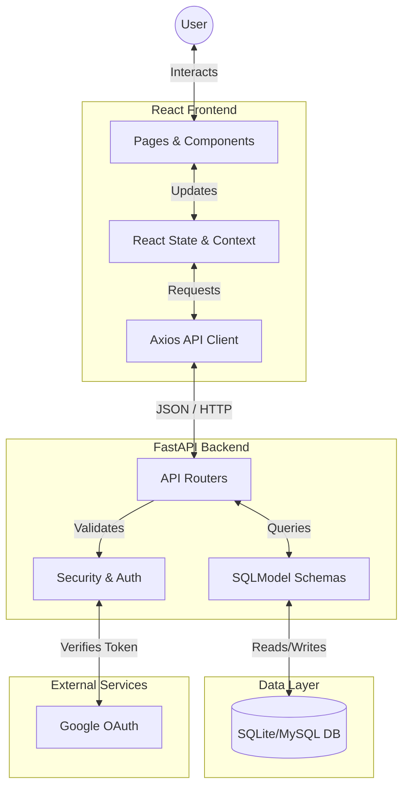
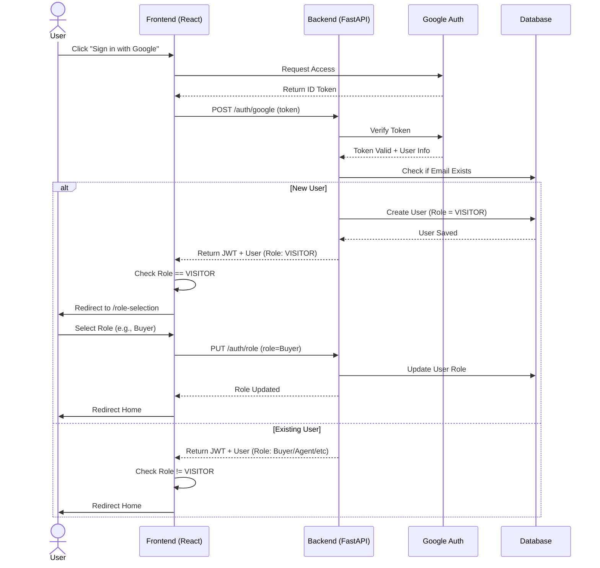

# Project Data Flow & Architecture

This document visualizes how data flows through the application, focusing on the User Authentication and Property Management lifecycles.

## 1. High-Level Architecture

The project follows a modern Client-Server architecture:

## 2. Google Authentication & Role Selection Flow

This specific flow diagrams how a user logs in with Google and how new users are handled.

## 3. Key Components Breakdown

### Frontend (Client Side)
*   **Pages**: `Login.jsx`, `Register.jsx`, `RoleSelection.jsx`, `Home.jsx`, `Properties.jsx`.
*   **Logic**: 
    *   Uses `axios` to communicate with the backend `http://localhost:8000`.
    *   Stores `token` and `role` in `localStorage` for simplified session management.
    *   `App.jsx` handles routing and page navigation.

### Backend (Server Side)
*   **Main**: `main.py` initializes the FastAPI app and includes routers.
*   **Routers** (`app/routers/`):
    *   `auth.py`: key endpoints for login (`/login`, `/google`) and role updates (`/role`).
    *   `properties.py`: Handles listing, searching, and viewing properties.
*   **Database**:
    *   `database.py`: Manages the connection session.
    *   `models.py`: Defines the table structures (`User`, `Property`, `Inquiry`, etc.).
    *   Uses **SQLModel** (wrapper around SQLAlchemy) for ORM features.

